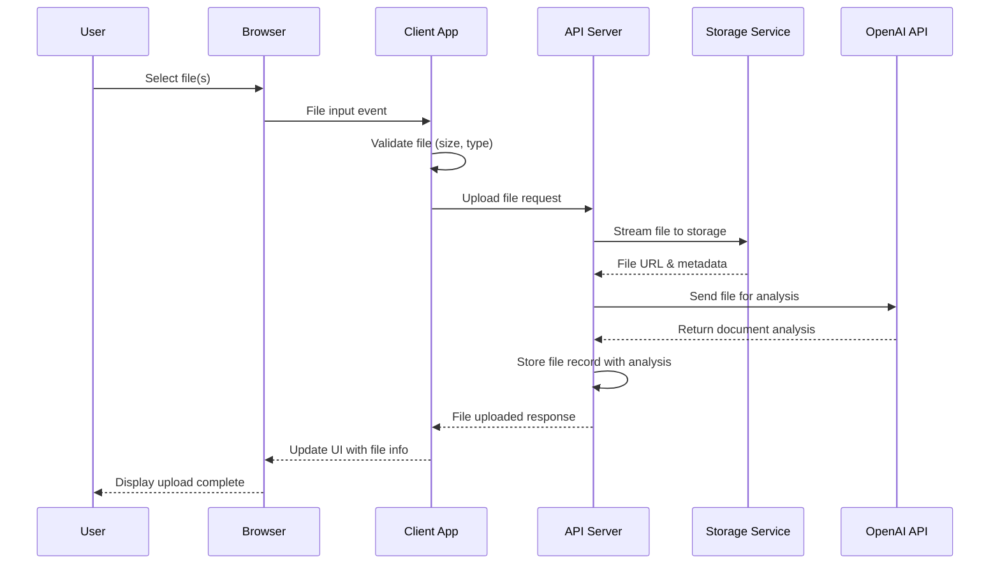
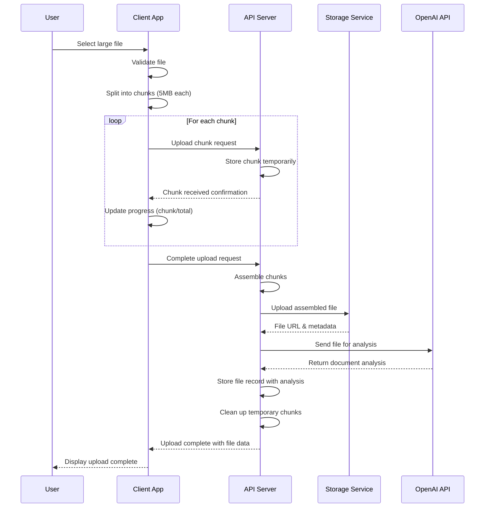
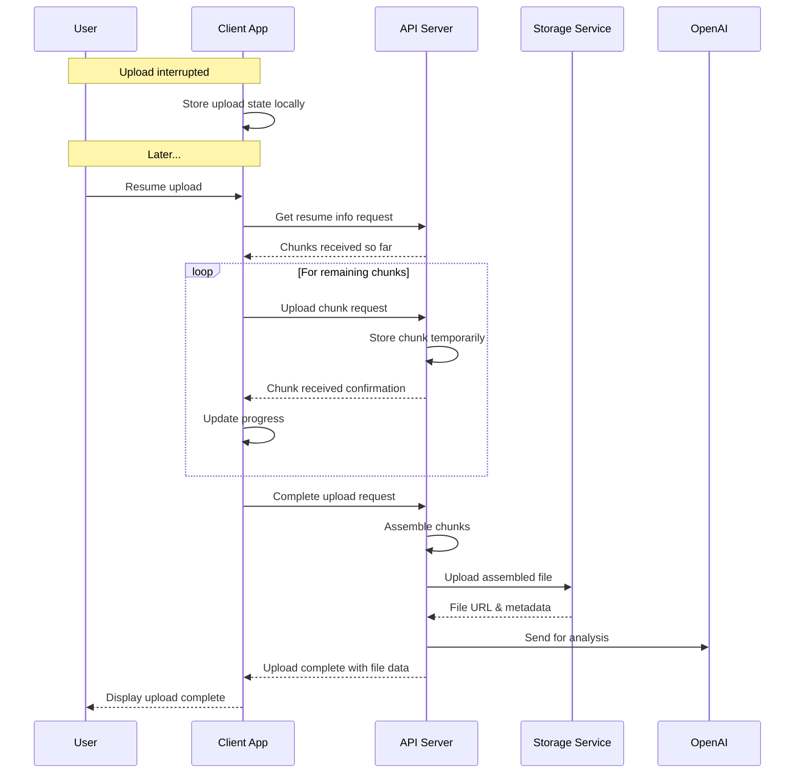
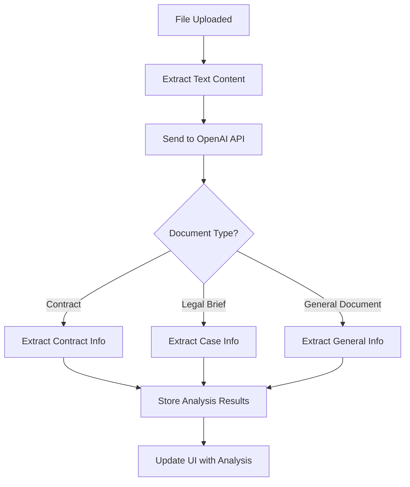

# File Upload Workflows Documentation

This document outlines the different workflows for file uploads in the Copy-Fact application, including standard uploads, chunked uploads, and AI-powered document analysis using OpenAI.

## Table of Contents
1. [Standard Upload Workflow](#standard-upload-workflow)
2. [Chunked Upload Workflow](#chunked-upload-workflow)
3. [Resume Upload Workflow](#resume-upload-workflow)
4. [Document Analysis with OpenAI](#document-analysis-with-openai)
5. [Implementation Details](#implementation-details)

## Standard Upload Workflow

The standard upload workflow is used for files smaller than the chunk size threshold (5MB by default).



## Chunked Upload Workflow

For larger files (>5MB), we use a chunked upload approach to improve reliability.



## Resume Upload Workflow

For interrupted uploads, we support resuming from where the upload left off.



## Document Analysis with OpenAI

After a file is uploaded, we process it with OpenAI to extract useful information like contract details, entities, and summaries.



## Implementation Details

### Where to Integrate OpenAI Analysis

The OpenAI integration should happen on the server side after file upload is complete:

1. In the `lawyerLensRouter.ts` file, after the file has been successfully uploaded to storage
2. For both standard and chunked uploads, in the same workflow before returning success to the client
3. The analysis can run asynchronously if needed, with a job queue for longer documents

### OpenAI Analysis Function Implementation

Add this function to the server in a new file `server/src/services/openaiService.ts`:

```typescript
import OpenAI from 'openai';
import fs from 'fs';
import path from 'path';
import { extractTextFromFile } from '../utils/fileUtils';

// Initialize OpenAI with API key from environment variables
const openai = new OpenAI({
  apiKey: process.env.OPEN_AI_KEY
});

/**
 * Analyze document and extract relevant information using OpenAI
 * @param filePath Path to the document file
 * @param fileName Original file name
 * @param mimeType MIME type of the file
 */
export async function analyzeDocument(filePath: string, fileName: string, mimeType: string) {
  try {
    // Extract text content from file based on type
    const textContent = await extractTextFromFile(filePath, mimeType);
    if (!textContent) {
      return {
        hasContract: false,
        documentType: 'unknown',
        message: 'Could not extract text from document'
      };
    }

    // Prepare a prompt for OpenAI based on document type inference
    const prompt = `
      Analyze the following document text and extract key information:
      
      1. Document Type: Determine if this is a contract, legal brief, email, or other document type
      2. If it's a contract, identify:
         - Parties involved
         - Contract purpose
         - Key dates (effective date, termination date)
         - Key terms and obligations
         - Any clauses that seem important
      3. Entities mentioned (people, companies, locations)
      4. Summary of the document (2-3 sentences)
      
      Return the response as a structured JSON object.
      
      Document text:
      ${textContent.substring(0, 15000)} // Limit to avoid token limits
    `;

    // Call OpenAI API
    const response = await openai.chat.completions.create({
      model: "gpt-4-turbo",
      messages: [
        {
          role: "system",
          content: "You are an expert document analyzer specialized in legal and business documents. Extract key information and return it in JSON format."
        },
        {
          role: "user",
          content: prompt
        }
      ],
      response_format: { type: "json_object" }
    });

    // Parse the response
    const analysisText = response.choices[0]?.message?.content || '{}';
    const analysis = JSON.parse(analysisText);
    
    // Determine if it's a contract
    const hasContract = analysis.documentType?.toLowerCase().includes('contract') || false;
    
    // Prepare contract-specific info if relevant
    const contractInfo = hasContract ? {
      hasContract: true,
      contractSummary: analysis.summary || '',
      parties: analysis.parties || [],
      effectiveDate: analysis.effectiveDate || '',
      terminationDate: analysis.terminationDate || '',
      relevantTerms: analysis.keyTerms || [],
    } : { 
      hasContract: false 
    };
    
    // Return the complete analysis
    return {
      ...contractInfo,
      documentType: analysis.documentType || 'unknown',
      entities: analysis.entities || [],
      summary: analysis.summary || '',
      fullAnalysis: analysis
    };
  } catch (error) {
    console.error('Error analyzing document with OpenAI:', error);
    return {
      hasContract: false,
      documentType: 'unknown',
      error: error instanceof Error ? error.message : 'Unknown error during analysis'
    };
  }
}
```

### Integration in LawyerLensRouter

Modify the `lawyerLensRouter.ts` file to call the OpenAI analysis function after successful upload:

```typescript
// Import the OpenAI service
import { analyzeDocument } from '../services/openaiService';

// In the file upload success handler:
// After storage service returns the upload result:
const uploadResult = await fileStorageService.uploadFileStream(tempFile);

// Add document analysis
let documentAnalysis = null;
try {
  documentAnalysis = await analyzeDocument(file.path, file.originalname, file.mimetype);
} catch (analysisError) {
  console.error('Error during document analysis:', analysisError);
  // Continue without analysis if it fails
}

// Create a database record for the file with analysis results
const fileData = {
  id: fileId,
  fileType: file.mimetype.split("/")[0],
  fileUrl: uploadResult.url,
  fileName: file.originalname,
  mimeType: file.mimetype,
  size: file.size,
  contentTypeHighLevel: [file.mimetype.split("/")[0]],
  uploadAt: new Date(),
  modifiedAt: new Date(),
  status: "completed",
  userId,
  additionalInfo: {
    checksum,
    originalPath: file.path,
    contractInfo: documentAnalysis
  }
};
```

### Text Extraction Utility

Create a utility function in `server/src/utils/fileUtils.ts` to extract text from different file types:

```typescript
import fs from 'fs';
import util from 'util';
import { exec } from 'child_process';
const execPromise = util.promisify(exec);

/**
 * Extract text content from a file based on its MIME type
 * This function will need external dependencies like pdf-parse, docx, etc.
 */
export async function extractTextFromFile(filePath: string, mimeType: string): Promise<string | null> {
  try {
    if (mimeType === 'application/pdf') {
      // For PDF files, use a library like pdf-parse
      // This is pseudo-code - you'll need to install the actual dependency
      const pdf = require('pdf-parse');
      const dataBuffer = fs.readFileSync(filePath);
      const data = await pdf(dataBuffer);
      return data.text;
    } 
    else if (mimeType === 'application/vnd.openxmlformats-officedocument.wordprocessingml.document') {
      // For DOCX files, use docx or similar
      const mammoth = require('mammoth');
      const result = await mammoth.extractRawText({path: filePath});
      return result.value;
    }
    else if (mimeType === 'text/plain') {
      // For plain text files
      return fs.readFileSync(filePath, 'utf8');
    }
    else if (mimeType.startsWith('image/')) {
      // For images, you could use OCR
      // This would require installing tesseract
      try {
        const { stdout } = await execPromise(`tesseract ${filePath} stdout`);
        return stdout;
      } catch (error) {
        console.error('OCR error:', error);
        return null;
      }
    }
    
    // If unsupported format, return null
    return null;
  } catch (error) {
    console.error('Error extracting text from file:', error);
    return null;
  }
}
```

### Required Dependencies

You'll need to install these packages:

```bash
npm install openai pdf-parse mammoth
# For OCR support
npm install tesseract.js
```

This implementation leverages OpenAI's GPT models to extract valuable information from documents, which can significantly enhance the searchability and usability of uploaded files in your application.
