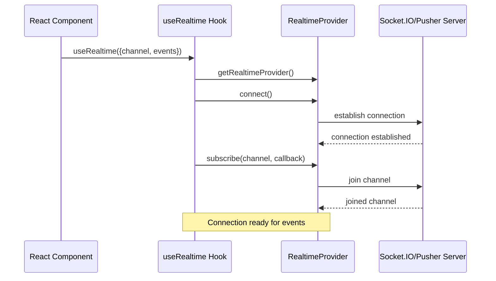
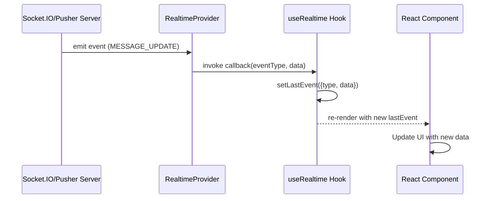
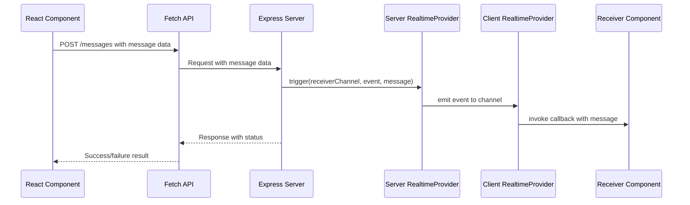
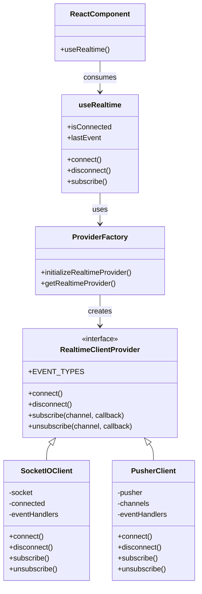

# Tutorial: Real-time Architecture in the Frontend

## Overview

This tutorial explains how to use the real-time functionality in your application's frontend. The real-time system uses a modular design that supports multiple providers (Socket.IO, Pusher) through a common interface.

## Architecture Components

1. **RealtimeClientProvider Interface**: The core abstraction for all real-time providers
2. **Provider Implementations**: Concrete implementations (Socket.IO, Pusher)
3. **Provider Factory**: Functions to create and manage provider instances
4. **useRealtime Hook**: React hook for components to consume real-time data

## Server vs. Client Components

- **Server Components**: Cannot use hooks or browser APIs. They should access real-time data through props or by converting to Client Components.
- **Client Components**: Can directly use the `useRealtime` hook to subscribe to real-time events. Mark these with `'use client'` directive.

## Usage in Components

### Basic Usage (Client Component)

```tsx
'use client';

import { useRealtime } from '@/hooks/useRealtime';
import { RealtimeEventType } from '@/lib/realtime';

export function ChatComponent() {
  // Subscribe to a specific channel and listen for message updates
  const { isConnected, lastEvent } = useRealtime({
    channel: 'user@example.com',
    events: [RealtimeEventType.MESSAGE_UPDATE],
    autoConnect: true,
  });
  
  // Use lastEvent to update your UI
  // isConnected tells you if the connection is active
}
```

### Initialization

Initialize the provider once in your application, typically in a layout component or app entry point:

```tsx
'use client';

import { initializeRealtimeProvider } from '@/lib/realtime';

// Initialize Socket.IO provider
initializeRealtimeProvider('socketio', {
  serverUrl: 'http://localhost:3010'
});

export default function RootLayout({ children }) {
  return <>{children}</>;
}
```

## Sequence Diagrams

### Connection and Subscription Flow



### Event Reception Flow



### Sending Message Flow



## Provider Switching

To switch between providers:

1. Update the initialization call:

```tsx
// Switch to Pusher
initializeRealtimeProvider('pusher', {
  key: process.env.NEXT_PUBLIC_PUSHER_KEY,
  cluster: process.env.NEXT_PUBLIC_PUSHER_CLUSTER,
});
```

2. Everything else remains the same - components using `useRealtime` don't need changes.

## Extending with a New Provider

To add a new provider (e.g., Firebase):

1. Create a new file `src/lib/realtime/providers/FirebaseClient.ts`:

```tsx
import { RealtimeClientProvider, RealtimeEventType } from '../types';

export class FirebaseClient implements RealtimeClientProvider {
  // Implement the interface methods
  async connect() { /* ... */ }
  disconnect() { /* ... */ }
  subscribe() { /* ... */ }
  unsubscribe() { /* ... */ }
}
```

2. Update the factory in `src/lib/realtime/index.ts`:

```tsx
// Add to ProviderType
type ProviderType = 'pusher' | 'socketio' | 'firebase';

// Add to initializeRealtimeProvider
case 'firebase': {
  const firebaseConfig = { ...defaultConfig.firebase, ...config };
  realtimeProvider = new FirebaseClient(firebaseConfig);
  break;
}
```

## Advanced Usage

### Manual Subscription and Control

For more control over subscriptions:

```tsx
'use client';

import { useRealtime } from '@/hooks/useRealtime';

export function AdvancedComponent() {
  const { isConnected, connect, disconnect, subscribe } = useRealtime({
    channel: 'room-123',
    autoConnect: false // Don't connect automatically
  });

  useEffect(() => {
    if (!isConnected) {
      connect();
    }
    
    // Custom subscription handling
    const unsubscribe = subscribe((eventType, data) => {
      // Custom event handling
      console.log('Event received:', eventType, data);
    });
    
    return () => {
      unsubscribe();
      disconnect();
    };
  }, [isConnected, connect, disconnect, subscribe]);

  return <div>Custom real-time component</div>;
}
```

## Architecture Diagram



By following this architecture, your application gains a flexible real-time communication system that can adapt to different providers while maintaining a consistent interface for your components.
